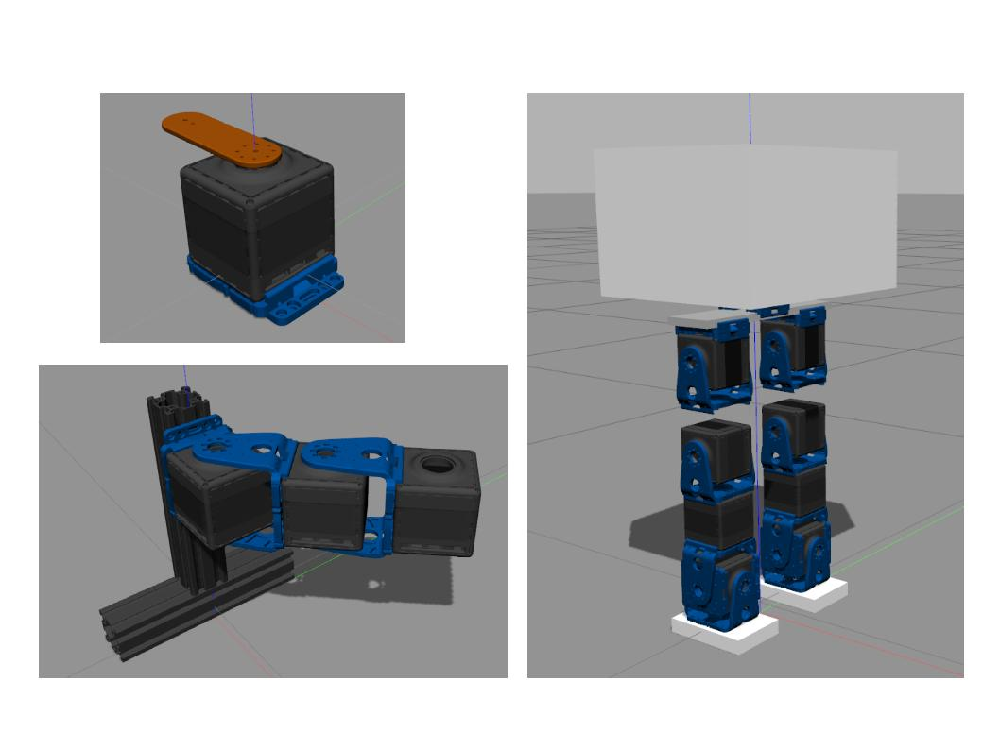

# Lab_Robots_ROS
Packages library of the CP robotics structures developed in ROS (simlar to [the Matlab/Simulink](https://github.com/CentroEPiaggio/Lab_Robots) one).

This library contains packages in which most of the robotic structures built at the Research Center Enrico Piaggio are modeled.
Rigid and elastic dynamics of those systems can be simulated in Gazebo leveraging on the **ROS-Gazebo-plugin-qbmove** plugin and on the URDF descriptions.

Up to now the structures for which the dynamic block is available are:
- simplecube (1Dof)
- 2Dofs 
- SoftLegs (by Giamma! :D)

# Requirement
The library requires the **ROS-Gazebo-plugin-qbmove** package, available [here](https://github.com/Richi90/ROS-Gazebo-plugin-qbmove), with its dependances.

# Visualization Library Preview

